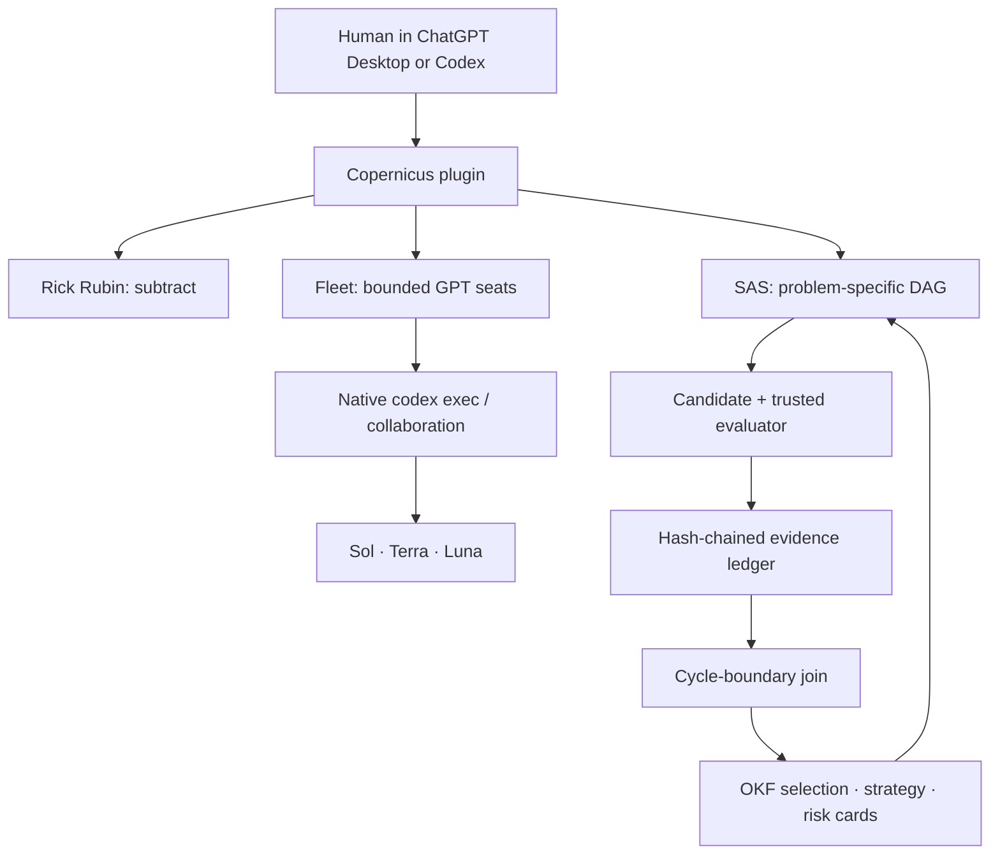

# Copernicus architecture

Copernicus adds workflows around Codex; it does not replace Codex's model,
authentication, sandbox, plugin, or Scheduled-task surfaces.



## Stable contracts

### Fleet

The lead decomposes a mission into leaf seats. Commands settle mechanical
questions before models. Every seat has bounded material, a typed output,
authority ceiling, independent verifier, falsifier, and stop rule. Sol handles
ambiguous high-value work, Terra handles everyday grounded work, and Luna Max
handles repeatable width. Missing models fail closed; another provider never
silently substitutes.

### Solution Autoresearch System

SAS is the invention loop:

```text
freeze problem regime
  -> invent the smallest useful DAG
  -> select hashed memory cards
  -> create a parent-linked candidate
  -> cheap filter
  -> authoritative evaluation
  -> independent semantic review when needed
  -> hash-identified cycle join
  -> promote, reject, quarantine, or retire a card
```

Roles are invented for the problem, but the execution format is fixed and
validated. No graph node may contain an arbitrary shell command. The deterministic
controller owns state; a model is never an immortal controller or its own verifier.

### Evidence

Canonical JSON and artifacts use SHA-256 identities. One locally append-only
JSONL ledger stores regime, card selection, candidate, evaluation, review, join,
and card-disposition receipts. Each row binds the previous row hash. Duplicate
IDs, edits, and broken chains fail validation. This is local integrity checking,
not immutable storage: deletion or truncation to a valid prefix needs an external
retained head or signed release to detect.

### Open Knowledge Format

OKF is durable semantic memory, not the run queue. Each concept is a Markdown
file with YAML frontmatter; relative links are knowledge edges; `index.md`
provides progressive navigation; `log.md` records material curation changes.
Copernicus begins with selection, strategy, and risk cards only.

## Deliberate cuts

There is no provider proxy, MCP server, daemon, database, graph database, vector
store, agent league, model vote as truth, automatic canonical-memory promotion,
or autonomous external-action path. Add one only after a measured run proves the
current files, DAG, evaluator, and ledger cannot do the job.
