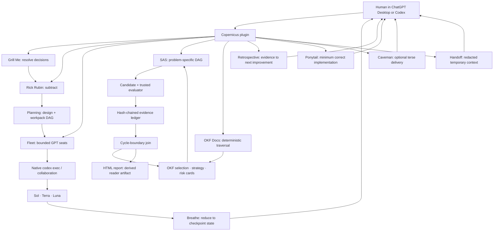

# Copernicus architecture

Copernicus adds workflows around Codex; it does not replace Codex's model,
authentication, sandbox, plugin, or Scheduled-task surfaces.



## Stable contracts

### Planning

Planning leaves focused changes on Codex's native plan surface and adds a
durable bundle only for substantial, dependency-linked, uncertain, or resumable
work. The bundle uses one YAML-frontmatter design, one concept per workpack,
relative links, generated indexes, and a living log. `parent` represents
containment while `depends_on` represents execution blocking. A Python
standard-library tool validates the restricted frontmatter contract, confined
paths, IDs, cycles, independent path ownership, test-first readiness, indexes,
and the next executable wave; it never executes workpack commands.

Planning may compose Fleet for independent evidence gaps and Auto-Research for
measured invention cycles. Workpacks are implementation contracts, not
canonical OKF memory or evidence that work is complete. A planning-only request
does not authorize source edits or implementation.

### Fleet

The lead decomposes a mission into leaf seats. Commands settle mechanical
questions before models. Every seat has bounded material, a typed output,
authority ceiling, independent verifier, falsifier, and stop rule. Sol handles
ambiguous high-value work, Terra handles everyday grounded work, and Luna Max
handles repeatable width. The validated `fleet.yaml` selects `terra-first` by
default, so an omitted lane resolves to Terra; `luna-breadth` is an explicit
alternative and an explicit lane always wins. Missing models fail closed;
another provider never silently substitutes.

### Breathe

Breathe composes Fleet into a gap-driven loop: the active preset maps bounded
evidence, Terra reduces equivalent claims, deterministic checks and a fresh
verifier test load-bearing conclusions, and the lead emits a short checkpoint
brief for a decision, verified delivery, or understanding. The lead alone
invokes Breathe or creates another bounded wave; workers never invoke Breathe
or spawn. A private optional ledger records only controlled explicit feedback
categories and never stores project content or rewrites the skill.

### Solution Autoresearch System

SAS is the invention loop:

```text
freeze problem regime
  -> invent the smallest useful DAG
  -> select hashed memory cards
  -> create a parent-linked candidate
  -> cheap filter
  -> authoritative evaluation
  -> independent semantic review when needed
  -> hash-identified cycle join
  -> promote, reject, quarantine, or retire a card
```

Roles are invented for the problem, but the execution format is fixed and
validated. No graph node may contain an arbitrary shell command. The deterministic
controller owns state; a model is never an immortal controller or its own verifier.

### Evidence

Canonical JSON and artifacts use SHA-256 identities. One locally append-only
JSONL ledger stores regime, card selection, candidate, evaluation, review, join,
and card-disposition receipts. Each row binds the previous row hash. Duplicate
IDs, edits, and broken chains fail validation. This is local integrity checking,
not immutable storage: deletion or truncation to a valid prefix needs an external
retained head or signed release to detect.

### Open Knowledge Format

OKF is durable semantic memory, not the run queue. Each concept is a Markdown
file with YAML frontmatter; relative links are knowledge edges; `index.md`
provides progressive navigation; `log.md` records material curation changes.
Copernicus begins with selection, strategy, and risk cards only.

OKF Docs is the deterministic navigation and maintenance layer over any
authorized Google OKF v0.2 bundle. It parses complete safe YAML, preserves
typed structural edges, supports metadata and backlink queries, and selects
budgeted evidence manifests for wide investigations. Its index and v0.1
migration writes are dry-run first and marker- or field-bounded. It never
executes declared resources, promotes model consensus to verification, moves
files, semantically merges cards, or replaces Markdown with a database.

### Practitioner HTML reports

HTML Report is a presentation layer after authorized evidence, Fleet synthesis,
or an SAS cycle join. It emits one self-contained browser artifact and may link
to a human-editable `.excalidraw` sidecar. Neither a report nor a diagram is an
evaluator, receipt, candidate, or memory card; human edits require an explicit
refresh before report claims change.

### Retrospective

Retrospective reads authorized task, repository, skill-use, or scheduled-run
artifacts; separates observations from inferences; traces the first observable
divergence; and proposes keep/change/try actions. It never reconstructs hidden
reasoning. Scheduled reviews use the host's native automation surface and remain
read-only and proposal-only until the user separately authorizes implementation.

### Companion fallbacks

Grill Me, Ponytail, Caveman, and Handoff are prompt-only skills. They use the
host's skill catalog as a best-effort signal to prefer a visible global
equivalent, then fall back to their bundled contract. They never inspect or
mutate global skill directories. Grill Me owns decision interrogation,
Ponytail owns implementation minimization, Caveman owns response style, and
Handoff owns a redacted temporary transport document; none is canonical memory,
an evaluator, or a Fleet runner.

## Deliberate cuts

There is no provider proxy, MCP server, daemon, global-skill installer or
filesystem resolver, database, graph database, vector
store, agent league, model vote as truth, automatic canonical-memory promotion,
autonomous external-action path, hosted report viewer, tracker, quiz service,
self-modifying skill, or learned personal profile.
Add one only after a measured run proves the current files, DAG, evaluator, and
ledger cannot do the job.
