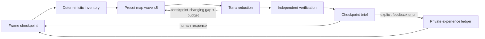

# Breathe explained

## Why it exists

Deep agent work and human decision-making operate at different bandwidths.
Fleet can inspect many evidence slices, but forwarding every worker answer to a
person merely transfers the coordination burden. A short generic summary is
also insufficient: it often erases disagreement, uncertainty, provenance, and
the consequences of choosing one path.

Breathe makes the human checkpoint the design constraint. It spends
machine attention between checkpoints, then returns the smallest representation
that is sufficient for the next decision, verified delivery, or understanding.

## The autoencoder analogy

The analogy is useful if its limits stay explicit:

```text
map waves -> typed claims -> semantic reduction -> verified checkpoint state
                                                     |
                                             checkpoint brief
                                                     |
                              expansion handles -> evidence and roster
```

- **Encoder:** Luna seats map distinct evidence and express it through one
  claim schema.
- **Bottleneck:** reducers retain only information that changes a checkpoint,
  confidence, priority, risk, or next action.
- **Decoder:** stable handles reopen the supporting evidence, dissent, or
  worker trace on demand.

This is not a learned neural autoencoder and it does not use embeddings.
Compression is acceptable only while important claims remain traceable and
expandable. The brief is deliberately lossy about repetition and process, but
not about material uncertainty or evidence.

## The operating loop



The lead, not a worker, owns Breathe and its recursion. “Respawn” means creating another
bounded wave for a named evidence gap. It never means allowing leaf agents to
invoke Breathe or create an uncontrolled tree. The shipped `terra-first` Fleet
preset uses Terra for unspecified map seats; select `luna-breadth` or explicit
Luna seats only when the work is repeatable breadth.

## What the brief optimizes

A good Breathe brief minimizes time-to-sound-checkpoint, not word count alone. It
must answer:

1. What became true enough to act on?
2. Is the checkpoint a choice, verified delivery, or understanding?
3. What choice is needed now, if any, and what does it gain, risk, or postpone?
4. Which uncertainty or dissent could still reverse it?
5. What will continue without another interruption?
6. How can the user reopen any compressed claim?

The default asks for at most three decisions when a choice is needed because a
longer list is usually a planning document masquerading as a checkpoint. When
no decision is needed, say `no decision required` and continue autonomously
inside the existing authority boundary.

Every completed lead mission emits the same checkpoint headings, including
execution-heavy work. Empty sections say `none`; a generic completion summary
does not replace the brief. Workers never emit the Breathe opening or brief.
The user's requested interruption determines the checkpoint type: a likely
remedy inside an explanation does not become a decision unless the user asked
to choose or authorize it. Before sending, self-check all seven exact headings;
`Expand` remains required even when its value is `none`.

## Experience without surveillance

Breathe improves briefing style from explicit interaction signals. For
example, repeatedly expanding `risks` suggests that risks should receive more
space by default; repeated `too-detailed` feedback suggests tighter briefs.
Choosing “no” on a project recommendation is not a briefing-quality signal and
must not enter the ledger.

The ledger deliberately cannot store notes. Its vocabulary is finite, its file
is private, and fewer than three samples do not alter defaults. This avoids
turning user projects, conversations, or decisions into an accidental personal
dataset. The user can inspect the exact aggregate with `experience.py summary`
and override its location with `COPERNICUS_BREATHE_EXPERIENCE_FILE`.

“Auto-improve” therefore means adapting presentation emphasis from explicit
feedback. It does not mean silently editing `SKILL.md`, changing safety rules,
promoting model prose to memory, or training a model.

## Example invocation

```text
Use $breathe to investigate whether this migration is ready. Work autonomously
through at most three five-seat map waves using the active Fleet preset.
Interrupt me only at a decision, verified delivery, or understanding checkpoint.
Return a checkpoint brief under 350 words with expandable evidence handles.
```

## Relationship to the other Copernicus skills

- `$rick-rubin` reduces speculative branches before investigation.
- `$fleet` owns GPT routing, worker execution, wave limits, and rosters.
- `$breathe` owns lead-only gap-driven reduction and the human checkpoint.
- `$auto-research` owns evaluated experiment cycles and proposed OKF memory.
- `$html-report` turns authorized results into a durable reader artifact when a
  conversation brief is not enough.

## Honest limitations

- Luna seats are correlated and do not create independent truth.
- A compact brief can still frame the wrong checkpoint; the trace makes that
  framing inspectable but does not eliminate judgment.
- Model availability and plan capacity belong to the signed-in Codex account.
- Preference counts are a tiny heuristic, not a learned user model.
- Breathe does not authorize external actions or make an unattended agent safe
  merely by reducing how often it speaks to the user.
