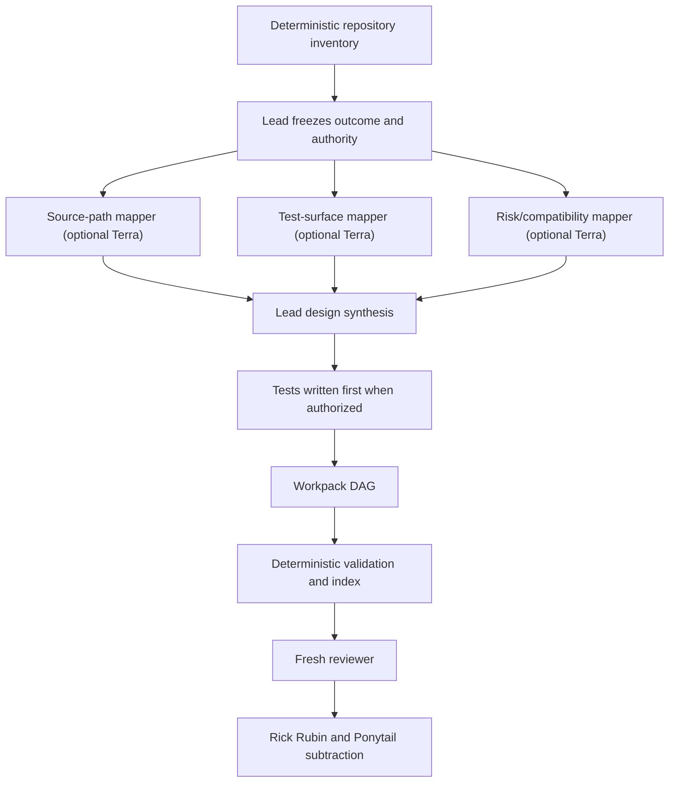
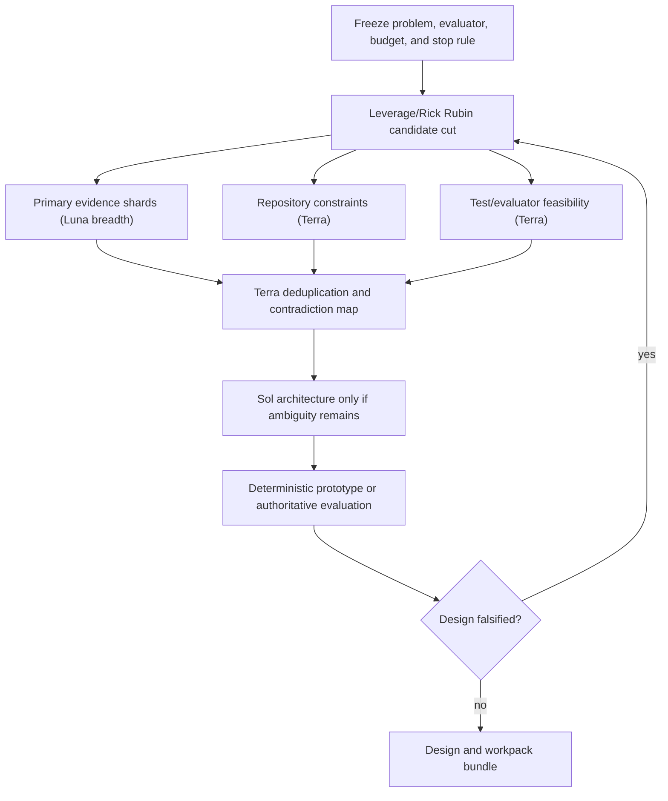
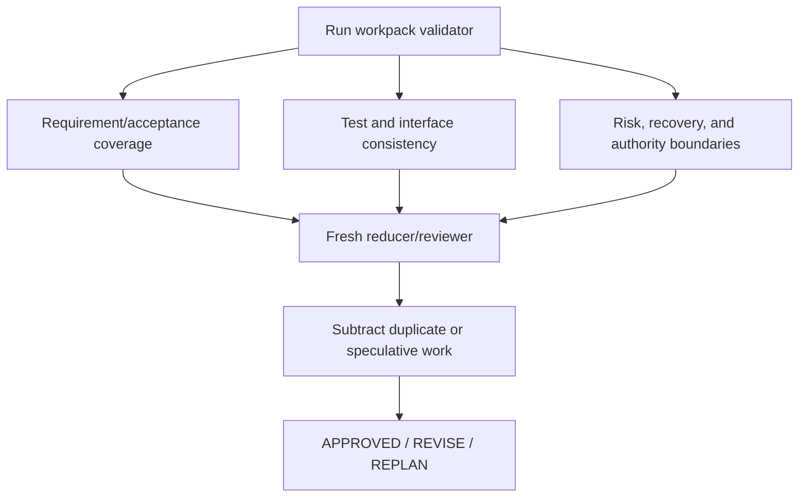

# Copernicus Planning explained

## Contents

- [Why it exists](#why-it-exists)
- [The boundary with native planning](#the-boundary-with-native-planning)
- [Modes](#modes)
- [The workpack bundle](#the-workpack-bundle)
- [Test-first readiness](#test-first-readiness)
- [Fleet graph templates](#fleet-graph-templates)
- [Leverage and subtraction](#leverage-and-subtraction)
- [Review contract](#review-contract)
- [Sources and clean-room boundary](#sources-and-clean-room-boundary)
- [Limitations](#limitations)

## Why it exists

Native Codex planning is enough for most focused changes. It becomes fragile
when a plan must survive context loss, coordinate independent owners, encode
blocking dependencies, or carry test and recovery evidence across a long
implementation. Copernicus Planning adds that durable layer without replacing
Codex Plan Mode or its ephemeral progress checklist.

The result is a small linked Markdown bundle. Humans can read it in GitHub or an
editor. Agents can navigate it progressively. One deterministic script catches
the graph and readiness failures that prose review handles poorly.

## The boundary with native planning

Use `native` when all are true:

- one outcome and one ownership boundary;
- the relevant implementation path is already known;
- no independent discovery wave is justified;
- the work can finish in the current task without a durable handoff.

Use durable workpacks when any is true:

- multiple deliverables block one another;
- tests or interfaces need agreement before implementation;
- work spans sessions, owners, repositories, or release boundaries;
- a user explicitly requests workpacks or durable planning;
- failure recovery or an external authority gate must remain visible.

Do not create a bundle merely because the template exists. Native `update_plan`
already tracks current progress; duplicating it in Markdown creates drift.

## Modes

### Native

Read, resolve the implementation decisions, and use the host's plan surface.
Do not call the workpack script and do not manufacture durable state.

### Workpacks

This is the default durable mode. Inspect current reality, write the design,
materialize tests when authorized, decompose by independently verifiable
outcomes, validate, index, and hand off the first ready wave.

### Discovery

Use when the solution cannot yet be planned honestly. Freeze the question and
evaluator, subtract weak candidates, and run the cheapest evidence/prototype
that can falsify the leading design. Use `$auto-research` when learning spans
measured candidate cycles. Only verified design decisions enter ready
workpacks; unresolved branches remain `UNVERIFIED` or `blocked`.

### Review

Do not regenerate the plan. Run the validator, compare the design against
requirements and source evidence, inspect test coverage and dependency/path
ownership, then subtract needless work. Return `APPROVED`, `REVISE`, or
`REPLAN`, with exact workpack IDs and the smallest corrections.

## The workpack bundle

```text
.planning/<mission>/
  index.md             generated navigation
  log.md               living decisions, progress, discoveries, outcomes
  design.md            authoritative design concept with YAML frontmatter
  workpacks/
    index.md           generated dependency waves and status
    WP-001.md          one independently verifiable deliverable
    WP-002.md
```

`design.md` answers why the change exists, what current evidence says, what the
system should become, which interfaces and boundaries matter, why this option
won, what can fail, and what is deliberately excluded.

Each workpack owns exactly one deliverable. Its frontmatter is machine-readable;
its body is the complete human implementation contract. Use YAML frontmatter
with plain scalars and JSON-compatible inline values:

```yaml
---
type: workpack
id: WP-002
title: "Reject expired sessions"
description: "Enforce expiry at the existing authentication boundary."
status: ready
priority: vital
parent: ""
depends_on: ["WP-001"]
paths: ["src/auth/session.py"]
test_paths: ["tests/auth/test_session.py"]
test_first: true
test_waiver: ""
updated: "2026-08-15"
---
```

The restricted subset keeps the parser dependency-free and predictable. Quote
strings that contain punctuation. Use JSON syntax for arrays and booleans.
Nested frontmatter is intentionally unsupported; put complex evidence in the
Markdown body.

### Status lifecycle

```text
draft -> ready -> active -> done
          |         |
          v         v
       blocked   blocked

draft/ready/blocked -> deferred
```

The script validates labels, not transitions. Record material state changes and
their evidence in `log.md`. `next` prints only `ready` workpacks whose declared
predecessors are `done`.

### Parent versus dependency

- `parent` says that one workpack is a conceptual child of another.
- `depends_on` says the predecessor must finish first.

A child does not automatically depend on its parent. Declare both when both
relations are real. The tool rejects cycles independently in each relation.

### Path ownership

All paths are relative to the implementation repository. Absolute paths,
backslashes, `..`, and path escapes are rejected. Two workpacks that own the
same path must have a dependency relationship; otherwise they are falsely
advertised as safe parallel work.

## Test-first readiness

For behavior-changing code:

1. Freeze the exact observable contract: values, errors, ordering, serialization,
   escaping, and side effects that matter to compatibility.
2. List the test cases before implementation.
3. Write the final success assertion in the repository when that source edit is
   authorized; do not weaken or replace it between red and green.
4. Run it and record the expected failure under `Tests written first`.
5. For a read-only or non-mutating contract, compare the affected paths or state
   before and after the operation.
6. Set `test_first: true` and list each test file in `test_paths`.
7. Validate with `--implementation-ready --repo-root <repo>`; the tool verifies
   that the named test files exist.
8. Implement the minimum behavior, rerun the focused and regression commands,
   then refactor while green.

Use the strongest available independent evaluator for a format or protocol when
it is already present. Do not add a mandatory runtime merely to certify a small,
documented subset that focused tests can validate.

Do not fabricate unit tests for documentation, generated output, declarative
configuration, physical/manual checks, or systems where the authoritative test
is an integration probe. Set `test_first: false`, give a specific
`test_waiver`, and put the strongest real check plus expected result in the
workpack. “Not applicable” alone is not a waiver.

A test file's existence does not prove test quality. The reviewer must still
trace each acceptance behavior to a test or an explicit waiver.

## Fleet graph templates

Fleet is optional. Deterministic inspection always comes first, workers never
spawn workers, and an author does not certify its own plan. Reuse the sibling
Fleet lane policy; these diagrams describe dependencies, not mandatory seat
counts.

### Workpacks graph



Delete every optional mapper whose answer is already available from source or a
command. Use Luna only for repeatable, non-overlapping breadth; Terra is the
normal grounded mapper/reducer; reserve Sol for genuinely ambiguous
architecture or final high-value review.

### Discovery graph



Do not turn model agreement into the `Design falsified?` gate. Use a test,
measurement, source comparison, or authorized human decision.

### Review graph



The three lenses may be one reviewer for a modest plan. Parallelize only when
the evidence slices are genuinely independent.

### Reusable seat contract

```text
ROLE: <one planning evidence function>. Read-only. Do not spawn subagents.
GOAL: <decision or artifact this evidence can change>.
MATERIAL: <exact authorized paths or primary sources>.
OUTPUT: claims | evidence | affected workpack/design decision | confidence | falsifier.
AUTHORITY: advisory only; never edit or approve the plan.
STOP: emit UNVERIFIED when evidence is missing; stop after the bounded slice.
```

## Leverage and subtraction

Do not enforce a literal 80/20 split. Rank optional work by:

- outcome unlocked;
- dependency-unblocking value;
- risk retired;
- evidence confidence;
- effort and reversibility.

Mark only the smallest outcome-carrying set `vital`. `important` work still
belongs in the accepted scope but need not block the first useful delivery.
`later` work is deliberately deferred. Safety, compatibility, accessibility,
data integrity, and acceptance tests are never optional leverage cuts.

Run subtraction twice:

1. Before decomposition: remove weak solution branches and speculative scope.
2. After validation: remove duplicate workpacks, one-use abstractions,
   unnecessary dependencies, and ceremony that does not change evidence or an
   implementation decision.

## Review contract

Return:

```text
VERDICT: APPROVED | REVISE | REPLAN

Deterministic findings
- validator error or none

Coverage
- requirement -> design decision -> workpack -> test/check

Plan risks
- workpack ID | evidence | failure | smallest correction

Cuts
- what goes | what remains in its place

First ready wave
- IDs from the deterministic `next` command, or why none is ready
```

`APPROVED` means the plan is implementation-ready under its stated authority;
it is not permission to execute. `REVISE` means bounded corrections preserve the
design. `REPLAN` means the outcome, architecture, evaluator, or authority
boundary is still unresolved.

## Sources and clean-room boundary

The design was informed by public concepts, not copied implementations:

- [OpenAI Codex Plan Mode](https://github.com/openai/codex/blob/main/codex-rs/collaboration-mode-templates/templates/plan.md)
- [OpenAI ExecPlans cookbook](https://github.com/openai/openai-cookbook/blob/main/articles/codex_exec_plans.md)
- [OpenAI Agents Python PLANS.md](https://github.com/openai/openai-agents-python/blob/main/PLANS.md)
- [OpenAI Harness Engineering](https://openai.com/index/harness-engineering/)
- [GitHub Spec Kit](https://github.com/github/spec-kit/blob/main/docs/index.md)
- [Oh My Codex planning skill](https://github.com/Yeachan-Heo/oh-my-codex/blob/main/skills/plan/SKILL.md)
- [Superpowers writing plans](https://github.com/obra/superpowers/blob/main/skills/writing-plans/SKILL.md)
- [Python graphlib](https://docs.python.org/3/library/graphlib.html)
- [YAML 1.2 relation to JSON](https://yaml.org/spec/1.2.0/)
- [Test-Driven Development](https://martinfowler.com/bliki/TestDrivenDevelopment.html)
- [CodePlan](https://www.microsoft.com/en-us/research/publication/codeplan-repository-level-coding-using-llms-and-planning-2/)

Copernicus implements its own smaller contract. It does not vendor text, code,
templates, runtimes, task services, or provider integrations from those
projects. Public bundles contain no private-project examples or local paths.

## Limitations

- A valid DAG can still encode a bad design.
- Test-file existence does not prove the test fails for the intended reason.
- Priority labels are judgment, not a value model.
- Same-model Fleet reviewers are correlated.
- Markdown state still needs maintenance during implementation.
- Cross-repository work may need one bundle per independently releasable system;
  do not create a hierarchy of hierarchies until a flat bundle measurably fails.
